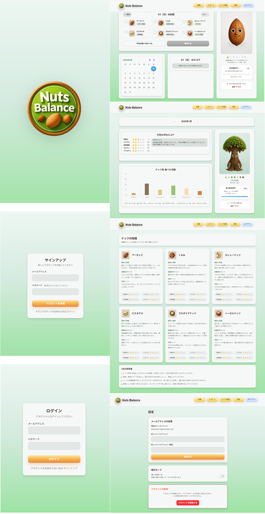
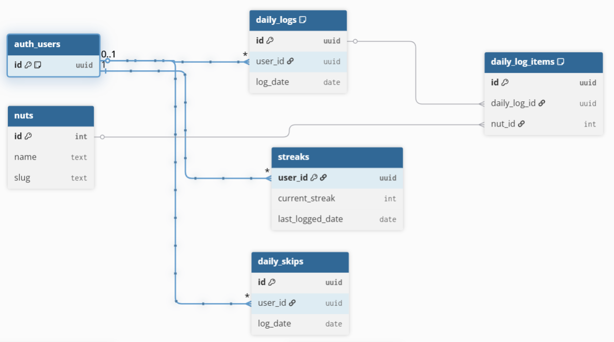

# Nuts Balance

Next.js / TypeScript / Supabase / PostgreSQL を使用した  
ナッツ摂取習慣化アプリです。

健康に良いスーパーフードである「ナッツ」を無理なく習慣化するため、  
毎日の摂取を記録し、月次レポートで傾向を振り返ることができます。

---

## 🌱 アプリ概要

Nuts Balance は、ナッツ摂取を「記録 → 可視化 → 習慣化」するための Web アプリです。

- 食べたナッツをチェック形式で簡単に記録
- 月次レポートで摂取傾向を可視化
- キャラクターの成長で継続をサポート
- ナッツごとの栄養情報を確認

---

## 💡 解決する課題  

ナッツは栄養価が高い一方で、

- 種類が多い
- 栄養の違いが分かりにくい
- 継続しづらい

といった課題があると感じました。

そこで本アプリでは「種類」に着目し、どのナッツを食べたかを日々記録することで  
栄養のバランスと継続の両方を意識できるようにしています。 

---

## 🚀 デモ


**本番URL：**  
デプロイURL：nuts-balance.vercel.app

**テストアカウント：**

Email: demouser1@example.com  
Password: demouser1234

---

## 🧩 主な機能


- **ナッツ記録**: 食べたナッツを選択して記録
- **栄養スコア**: 5軸（抗酸化、ミネラル、食物繊維、ビタミン、多様性）で栄養バランスを可視化
- **ストリーク追跡**: 連続記録日数に応じてキャラクターが成長
- **月次レポート**: 月ごとの摂取傾向とスコア推移を確認
- **ダークモード**: ライト/ダークテーマの切り替え対応

---

## 🛠 技術スタック

### フロントエンド
- Next.js 15 (App Router)
- React 19
- TypeScript 5
- Tailwind CSS 4
- next-themes（ダークモード）

### バックエンド
- Supabase 
    - PostgreSQL 
    - Auth 
    - RLS

### ライブラリ  
- react-hook-form + zod
- react-day-picker
- Recharts
- sonner 

### テスト  
- Vitest（ユニットテスト）

---

## 🧠 技術選定理由

### Next.js + Supabase を選んだ理由

Next.js App Routerを使うことで、画面の処理（Client）とデータ処理（Server）を分けて実装しやすいと考えました。  
またServer Actionsを利用することで、APIを作成しなくてもサーバー側で安全にデータ更新処理ができる点も魅力でした。

Supabaseは PostgreSQL（データベース）、認証、RLS（セキュリティ）をまとめて利用できるサービスです。  
少ない構成でユーザーごとのデータ保護を実装できると考え、バックエンドとして採用しました。  

---

## 🏗 アーキテクチャ設計

### 1. Server / Client の役割分離
- SupabaseクエリはServer側で実行
- Clientから直接DB操作を行わない設計
- データ更新はServer Actions経由

### 2. RPCによるトランザクション保証
複数テーブルを更新する処理は、Supabase RPCにまとめて実装しています。  
例  
- `upsert_daily_log`
- `mark_daily_skip`
- `delete_user_account`

これにより、複数テーブル更新でもデータの不整合が起きにくいようにしています。

### 3. RLSによるデータ保護
Supabase のRow Level Securityを利用し、ログインユーザーは自分のデータのみ取得可能にしました。


### 4. ドメインロジックの分離
スコア計算や月次レポート集計などの処理は`lib/domain/` にまとめて実装しています。  
UIやデータ取得処理と分けることでコードの役割が分かりやすくなるようにしました。

例：

- `getGrowthStage()`（成長ステージ判定）
- `aggregateMonthlyReport()`（月次レポート集計）

### 5. Server Actionsの戻り値設計
Server Actionsの戻り値は `{ success: boolean; message: string }` に統一し、  
成功 / 失敗を分かりやすく扱えるようにしています。

---

## 🗺️ ER図  



ユーザーは1日ごとに `daily_logs` を作成し、  
その日に食べたナッツを `daily_log_items` として記録します。

ナッツ情報は `nuts` マスタテーブルで管理しています。  
また、連続記録日数は `streaks`、記録をスキップした日は `daily_skips` に保存します。

#### リレーション
- `auth_users` と `daily_logs` は 1:N
- `daily_logs` と `daily_log_items` は 1:N
- `daily_log_items` と `nuts` は N:1

#### データ整合性
- `daily_logs`  
  `UNIQUE(user_id, log_date)` により1ユーザー1日1ログを保証
- `daily_log_items`  
  `UNIQUE(daily_log_id, nut_id)` により同一ナッツの重複登録を防止

これらの制約により、データの重複や不整合をデータベースレベルで防止しています。   

---

## 🕸️ DB設計意図  

本アプリでは「1日1回のナッツ記録」を扱うため、記録本体とナッツ明細をテーブル分割して設計しました。  

- `daily_logs`  
  ユーザーの1日の記録本体を管理するテーブルです。  
  `UNIQUE(user_id, log_date)` を設定することで、  
  1ユーザー1日1記録をデータベースレベルで保証しています。

- `daily_log_items`  
  その日に食べたナッツの明細テーブルです。  
  `daily_logs` と1対多の関係を持ち、  
  `UNIQUE(daily_log_id, nut_id)` により同一ナッツの重複登録を防止しています。

- `nuts`  
  ナッツ種類のマスターテーブルです。  
  記録テーブルと分けることで、ナッツ情報の追加や変更に柔軟に対応できるようにしています。

- `daily_skips`  
  「未記録」と「意図的なスキップ」を区別できるよう、記録とは別テーブルとして管理しています。

---

## 🔐 セキュリティ設計  

- SupabaseのRLSを全テーブルに適用し、
  ユーザーが自分のデータのみ取得できるようにしています。

- Server Actions側でも認証チェックを行い、
  未認証ユーザーがデータ操作できないようにしています。

- Service Role Keyはサーバー側のみで使用し、
  クライアントからは利用できないようにしています。

---

## 📁 プロジェクト構成

```
src/
├── app/
│   ├── (public)/       # 認証不要ページ（ログイン、サインアップ等）
│   ├── (protected)/    # 認証必須ページ
│   │   ├── app/        # ダッシュボード
│   │   ├── report/     # 月次レポート
│   │   ├── nuts/       # ナッツ図鑑
│   │   └── settings/   # 設定
│   └── api/            # APIルート
├── lib/
│   ├── supabase/       # Supabaseクライアント
│   ├── domain/         # ビジネスロジック
│   └── types.ts        # 型定義
└── middleware.ts       # ルート保護

```
## 💪🏻 実装で意識したポイント 

- **継続しやすいUX**  
毎日の記録が負担にならないよう、操作をシンプルにすることを意識しました。    
また、連続記録日数に応じてキャラクターが成長する仕組みを取り入れています。  

- **DB制約によるデータ整合性**  
  アプリ側のバリデーションだけでなくDB制約でも整合性を担保しています。  
    - `UNIQUE(user_id, log_date)`
    - `UNIQUE(daily_log_id, nut_id)`

- **RPCによる安全な更新処理**  
  ナッツ記録では `daily_logs` と `daily_log_items` を同時に更新する必要があります。  
  そのため処理をSupabase RPCにまとめ、複数テーブル更新でも不整合が起きにくいようにしました。

- **Server / Client 責務分離**  
  データ取得や更新処理はServer側で実行し、ClientはUI表示に専念する構成にしています。

- **ユーザー削除時の整合性確保**  
  Supabase AuthとアプリDBの削除順序を考慮し、  
  先にAuthを削除 → その後DBを削除する構成にしています。  
  また削除処理は冪等性を持たせ、失敗した場合でも再実行できるようにしています。

---

## 🖥 ローカル開発  
```
npm install
npm run dev
```
Node.js 20以上が必要です。  

---

## 🧪 テスト

Vitest を使用し、ドメインロジックのユニットテストを行っています。

例：
- `getGrowthStage()` の判定テスト

```bash
npm run test
```
---

## 📌 今後の改善  
- Server Actionsや主要画面を対象にしたテストの拡充
- ナッツの偏りや不足傾向が分かるよう、月次レポートの分析表示を強化
- 過去の記録をより編集しやすくするUI改善